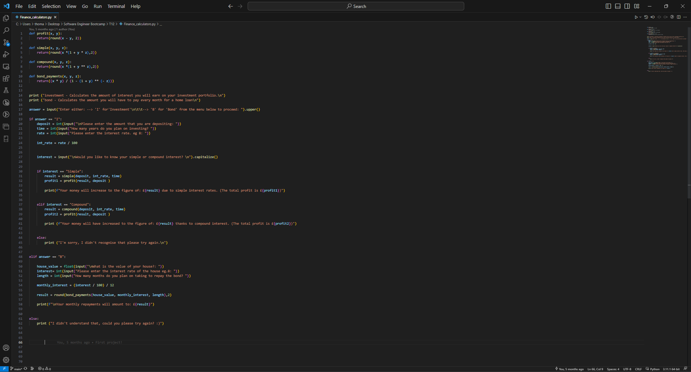

# First-Project-Finance-calculater
___

This was my first project that I created using Python, a simple and user friendly financial calculator,
which gives the user the choice between selecting to calculate simple/compound interest rates or 
bond payments on a house instead.

